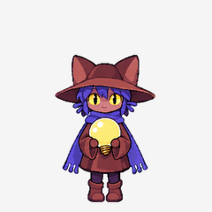

# Codex 桌宠 Niko

[English](README.md)

一个免费、非官方的 OneShot Niko 同人桌宠，抱着太阳陪你使用 Codex。



包含 9 种动作状态和 16 个注视方向。待机时双脚保持着地，每 6.22 秒循环中保留一次完整的 220 毫秒眨眼；跳跃时闭眼、张嘴开心笑，并配有脚部动作。Niko 也会照顾怀里的灯泡。

## 安装

安装只需要 Python 3.10 或更新版本：

```sh
git clone https://github.com/Rockdu/niko-codex-pet.git
cd niko-codex-pet
python3 tools/install.py
```

安装程序会将文件复制到 Codex 的宠物目录，并自动备份已有版本。安装后，在 Codex 中选择 **Niko**。如果已经选中了 Niko，请重新选择一次以加载更新；安装程序不会自动刷新桌宠。

如果使用了其他 Codex 主目录，可以运行 `python3 tools/install.py --codex-home /path/to/codex-home`。使用 `python3 tools/install.py --static` 可安装静态图集备用版；它仍包含常规动作帧，但不包含动画图集中的额外待机时序。

本项目使用 v2 自定义宠物格式。开发时使用 macOS Codex 26.915.31029 进行了检查，尚未验证所有 Codex 版本的兼容性。

## 校验与重新构建

安装不需要图像处理依赖。如需校验文件，或从仓库中的源图重新构建：

```sh
python3 -m venv .venv
source .venv/bin/activate
python3 -m pip install -r requirements.txt
python3 tools/validate.py
```

构建还需要 `webpmux`，macOS 可通过 `brew install webp` 安装：

```sh
python3 tools/build.py --output build
```

[`pet/`](pet/) 包含可直接安装的文件，[`source/`](source/) 包含动画源图，[`assets/`](assets/) 包含预览。构建工具使用源图和 `source/animation.json` 即可重新构建，无需再次调用图像生成服务。

## 美术与许可

**本项目原创工具代码和文档使用 MIT 许可，角色美术不包含在 MIT 许可内。** 具体范围见 [LICENSE](LICENSE)，美术归属、来源及使用限制见 [ARTWORK-NOTICE.md](ARTWORK-NOTICE.md)。

Niko 和 OneShot 归各自权利人所有，包括 Future Cat LLC。本项目与 Future Cat、OneShot 的发行商及 OpenAI 无关联，也未获得其背书。美术通过 AI 生成，并经过合成与动画调整；它是非官方同人作品，不是官方游戏精灵素材包。

美术在此作为免费、非商业同人作品分享。OneShot 开发者曾在 [2022 年官方创作者 AMA 中鼓励非商业同人创作](https://www.reddit.com/r/NintendoSwitch/comments/xk77gr/comment/ipclj1i/)，但这段表态并非角色的开源许可，也不是针对本项目的专门授权。本仓库不授予商业使用权或 OneShot 角色本身的权利。

问题反馈、建议或权利相关请求，请[提交 issue](https://github.com/Rockdu/niko-codex-pet/issues)。
